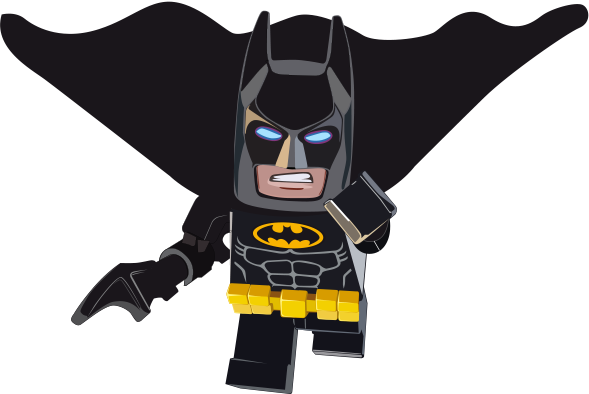

# Introducción a app

Esta app servirá para....

## Indice
[[TOC]]

## Principios de diseño

Los principios de diseño son los siguientes:

### configurar cabeceras

Configuración cabeceras

## Principios de diseño2

Los principios de diseño son los siguientes:

## Principios de diseño3

Los principios de diseño son los siguientes:

## Principios de diseño4

Los principios de diseño son los siguientes:

## Principios de diseño5

Los principios de diseño son los siguientes:

Descarga tu ppt aquí: [Presentación Introducción a WECO :floppy_disk:](../presentaciones/ALTIA_Plantilla.pptx)

## Principios de diseño6

Los principios de diseño son los siguientes:

## Principios de diseño7

Los principios de diseño son los siguientes:

## Principios de diseño8

Los principios de diseño son los siguientes: